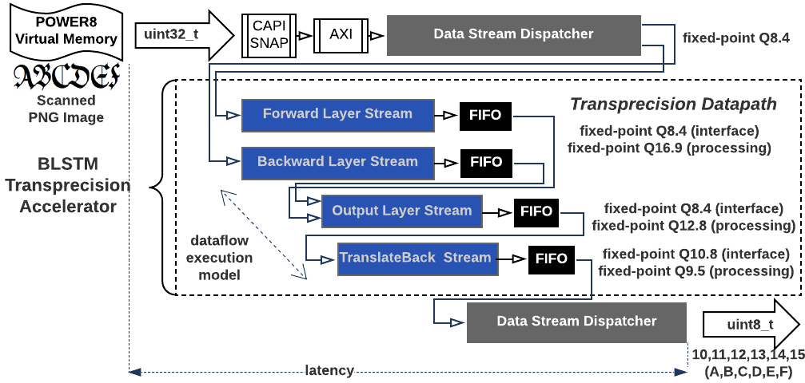

# HLS_BLSTM (community edition)
A BLSTM FPGA accelerator of an OCR application, using CAPI/SNAP.

- This is the source code for the FPGA accelerator of the blstm microbenchmark of [OPRECOMP project](http://oprecomp.eu/). It includes the host code software (C/C++) and the FPGA synthesizable code (C/C++).

- This SNAP example is transforming scanned images of text (in PNG format) to characters, using the Bidirectional Long Short-term Memory (BLSTM) Recurrent Neural Network (RNN) algorithm.
  - code can be executed on the CPU (will transform all images to characters), using OpenMP for speedup.
  - code can be simulated (will transform all images to characters in simulation) - this process is slow, due to RTL simulation.
  - code can then run in hardware when the FPGA is programmed (will transform all images to characters in hardware).


- The code is organized in three main directories:
  - **hw:** The application code that is used for generating the programming file for the FPGA with the use of SNAP framework and Xilinx Vivado HLS tool.
  - **sw:** The application code part running on host (POWER8): Reading of input image files stored on disk, preparing of WED struct, feeding of image data to FPGA with DMA, reading of results from FPGA, accuracy comparison with groundtruth.
  - **include:** The place of common code for the two subsystems (host & fpga). It includes header files with i) application parameters, ii) compilation parameters and iii) runtime parameters.
  - **data:** The folder containing sample images fro testing.

- The accelerator introduces a transprecision datapath and manages to deliver better execution speedup and energy efficiency, compared to all-software solution on POWER8 as well as high-end GPUs (e.g. Nvidia K80, P100).




## Community edition note
This version serves as an example for the SNAP community and it is not including the complete optimization setup (advanced memory interleaving and unrolling). Please contact [OPRECOMP project](http://oprecomp.eu/) for more information of the optimized version.


## Getting started
* Preparation

  * Clone the directory on you SNAP's action folder
```Bash
git clone https://github.ibm.com/DID/hls_blstm <SNAP_ROOT>/actions/hls_blstm
```
  * Add the related section of HLS_BLSTM into SNAP, by replacing some files. A script is batching the copying.
  ```Bash
  cd <SNAP_ROOT>/actions/hls_blstm/snap_modification_files
  make all
  ```
  * Build the Vivado project
  ```Bash
  cd <SNAP_ROOT>/actions/hls_blstm/hw
  make
  ```
  * Set target period for HLS

    In the generated `run_hls_script.tcl` replace the clock period from 4 to 2.7 (after experimentation, we found that the HLS target 2.7ns is producing better RTL in terms of resources and latency, than 4ns). This only affects the HLS target and not the final operating frequency which is 250MHz.
  ```tcl
  create_clock -period 2.7 -name default
  ```
  * Select action on SNAP_ROOT
  ```Bash
  cd <SNAP_ROOT>
  make snap_config (In the ncurses menu select HLS_BLSTM)
  ```

* Run the software version (either on x86 or POWER8/9)
```Bash
cd <SNAP_ROOT>/actions/hls_blstm/sw
make
SNAP_CONFIG=CPU ./snap_blstm -i ../data/samples_1/ -g ../data/gt_1/
```

* Run simulation of the hardware version (only on x86)
```Bash
cd <SNAP_ROOT>
make model
make sim
.
(In the new xterm window run)
../../../../software/tools/snap_maint -vvv
SNAP_CONFIG=FPGA ../../../../actions/hls_blstm/sw/snap_blstm -i ../../../../actions/hls_blstm/data/samples_c/ -g ../../../../actions/hls_blstm/data/gt_1/
(CTRL+D when simulation finishes)
.
(In the snap terminal, you may inspect the simulation waveforms)
xsim -gui hardware/six/xsim/latest/top.wdb &
```

* Run the hardware version (bitstream preparation on x86, run on POWER8/9)
```Bash
cd <SNAP_ROOT>
make image
scp <SNAP_ROOT>hardware/build/Images/<file>.bin user@remoteP8Server://path_to_bin
.
(ont the remote POWER8/9 server, given that you have cloned the repo and having prepared files like in x86)
sudo capi-flash-script /path_to-bin/file.bin
cd <SNAP_ROOT>/actions/hls_blstm/sw
SNAP_CONFIG=0x0 make
sudo ../../../software/snap_maint -vvv
sudo SNAP_CONFIG=FPGA ./snap_blstm -i ../data/samples_1/ -g ../data/gt_1/ -C0
```

## Dependencies
### i. FPGA Card selection

As of now, the following FPGA card has been used with HLS_BLSTM:

*  [Alpha-Data ADM-PCIE-KU3](http://www.alpha-data.com/dcp/products.php?product=adm-pcie-ku3)

### ii. Development
#### a) SNAP
The HLS_BLSTM example has been developed with [SNAP framework](https://github.com/open-power/snap). As such, it inherits the files hierarchy and coding style of this framework.

#### b) Xilinx Vivado
The code has been tested with Vivado 2016.4, 2017.1, 2017.2, 2017.3, 2017.4 and 2018.1. The best compilation results, in terms of resources utilization and latency, have been derived with 2017.2. However, the most recent version, i.e. 2018.1, is recommended, for compatibility with SNAP upstream.

#### c) PSL (CAPI module on FPGA)
Access to CAPI from the FPGA card requires the [Power Service Layer (PSL)](https://www.ibm.com/systems/power/openpower).


#### d) Build process
The HLS_BLSTM example can be directly cloned into SNAP's example directory. Building the code and running the make environment requires the usual development tools `gcc, make, sed, awk`. If not installed already, the installer package build-essential will set up the most important tools.

#### e) PSL Simulation Environment (PSLSE)
For simulation, we use the [PSL Simulation Environment (PSLSE)](https://github.com/ibm-capi/pslse). Smaller test data are included in the `./data` folder that allow the simulation of small number of input image chunks, which can be tested and verify the functionality of the accelerator in a couple of seconds.

## Documentation
The HLS_BLSTM source code is automatically documented with Doxygen. Run `make dox` to generate html documenttion. TODO: The `./doc` folder is containing  a complete tutorial of the example.

## Cite
The presetnt work may be referred by the following citation:
`D. Diamantopoulos, H. Giefers and C. Hagleitner, "ecTALK: Energy efficient coherent transprecision accelerators — The bidirectional long short-term memory neural network case,"` 2018 IEEE Symposium in Low-Power and High-Speed Chips (COOL CHIPS), Yokohama, Japan, 2018, pp. 1-3. doi: 10.1109/CoolChips.2018.8373077, URL: http://ieeexplore.ieee.org/stamp/stamp.jsp?tp=&arnumber=8373077&isnumber=8373063

## Acknowledgement
The original BLSTM software code of this example has been coded by [Vladimir Rybalkin](rybalkin@eit.uni-kl.de). It was provided by the Microelectronic Systems Design Research Group, University of Kaiserslautern, as part of the [OPRECOMP](http://oprecomp.eu/) microbenchmark suite.

## Next steps
The hls_blstm demonstrator has been already tested on the ADM-PCIE-KU3 device (FPGA XCKU060-FFVA1156), attached a POWER8 host, on IBM Zurich Heterogeneous Cloud (ZHC2) cloud. Future milestones are:

- [ ] Porting to ADM-PCIE-8K5 (XCKU115-2-FLVA1517E) - almost double resources than KU3.
- [ ] Porting to POWER9 + CAPI2.0

## License
Copyright 2018 - The OPRECOMP Project Consortium,
                 IBM Research GmbH. All rights reserved.

Licensed under the Apache License, Version 2.0 (the "License");
you may not use this file except in compliance with the License.
You may obtain a copy of the License at

    http://www.apache.org/licenses/LICENSE-2.0

Unless required by applicable law or agreed to in writing, software
distributed under the License is distributed on an "AS IS" BASIS,
WITHOUT WARRANTIES OR CONDITIONS OF ANY KIND, either express or implied.
See the License for the specific language governing permissions and
limitations under the License.
