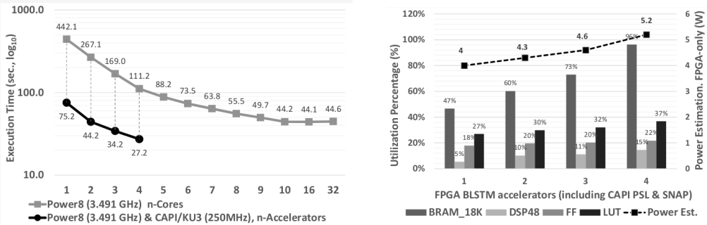

# HLS_BLSTM (community edition)
A BLSTM FPGA accelerator of an OCR application, using CAPI/SNAP.

- This is the source code for the FPGA accelerator of the blstm microbenchmark of [OPRECOMP project](http://oprecomp.eu/). It includes the host code software (C/C++) and the FPGA synthesizable code (C/C++).

- This SNAP example is transforming scanned images of text (in PNG format) to characters, using the Bidirectional Long Short-term Memory (BLSTM) Recurrent Neural Network (RNN) algorithm.
  - code can be executed on the CPU (will transform all images to characters), using OpenMP for speedup.
  - code can be simulated (will transform all images to characters in simulation) - this process is slow, due to RTL simulation.
  - code can then run in hardware when the FPGA is programmed (will transform all images to characters in hardware).


- The code is organized in three main directories:
  - **hw:** The application code that is used for generating the programming file for the FPGA with the use of SNAP framework and Xilinx Vivado HLS tool.
  - **sw:** The application code part running on host (POWER8): Reading of input image files stored on disk, preparing of WED struct, feeding of image data to FPGA with DMA, reading of results from FPGA, accuracy comparison with groundtruth.
  - **include:** The place of common code for the two subsystems (host & fpga). It includes header files with i) application parameters, ii) compilation parameters and iii) runtime parameters.
  - **data:** The folder containing sample images fro testing.

- The accelerator introduces a transprecision datapath and manages to deliver better execution speedup and energy efficiency, compared to all-software solution on POWER8 as well as high-end GPUs (e.g. Nvidia K80, P100).


## Community edition note
This version serves as an example for the SNAP community and it is not including the complete optimization setup (advanced memory interleaving and unrolling). Please contact [OPRECOMP project](http://oprecomp.eu/) for more information of the optimized version.


## Getting started
* Preparation

  * Clone the directory on you SNAP's action folder
```Bash
git clone https://github.com/oprecomp/HLS_BLSTM.git <SNAP_ROOT>/actions/hls_blstm
```
  * Add the related section of HLS_BLSTM into SNAP, by replacing some files. A script is batching the copying.
  ```Bash
  cd <SNAP_ROOT>/actions/hls_blstm/snap_modification_files
  make all
  ```
  * Build the Vivado project
  ```Bash
  cd <SNAP_ROOT>/actions/hls_blstm/hw
  make
  ```
  * Set target period for HLS

    In the generated `run_hls_script.tcl` replace the clock period from 4 to 2.7 (after experimentation, we found that the HLS target 2.7ns is producing better RTL in terms of resources and latency, than 4ns). This only affects the HLS target and not the final operating frequency which is 250MHz.
  ```tcl
  create_clock -period 2.7 -name default
  ```
  * Select action on SNAP_ROOT
  ```Bash
  cd <SNAP_ROOT>
  make snap_config (In the ncurses menu select HLS_BLSTM)
  ```
  * Latest supported snap version: [2fb8fb85f9a6ec7bdbf837522c8ce839e87de281](https://github.com/open-power/snap/commit/2fb8fb85f9a6ec7bdbf837522c8ce839e87de281) (Updated 27-09-2019)
  ```Bash
  cd <SNAP_ROOT>
  git checkout 2fb8fb85f9a6ec7bdbf837522c8ce839e87de281
  ```

* Run the software version (either on x86 or POWER8/9)
```Bash
cd <SNAP_ROOT>/actions/hls_blstm/sw
make
LD_LIBRARY_PATH=$PSLSE_ROOT/libcxl/ SNAP_CONFIG=CPU ./snap_blstm -i ../data/samples_1/ -g ../data/gt_1/
```

* Run simulation of the hardware version (only on x86)
```Bash
cd <SNAP_ROOT>
make model
make sim
.
(In the new xterm window run)
../../../../software/tools/snap_maint -vvv
SNAP_CONFIG=FPGA ../../../../actions/hls_blstm/sw/snap_blstm -i ../../../../actions/hls_blstm/data/samples_c/ -g ../../../../actions/hls_blstm/data/gt_1/
(CTRL+D when simulation finishes)
.
(In the snap terminal, you may inspect the simulation waveforms)
xsim -gui hardware/six/xsim/latest/top.wdb &
```

* Run the hardware version (bitstream preparation on x86, run on POWER8/9)
  * Due to a bug in floating point - to - fixed point conversion in C++ synthesizable code in versions of Vivado > 2017.1, we had to do the casting of input pixel values from floating to fixed point in CPU.
  * To do so, we need the equivalent Xilinx libraries in order to compile an executable in POWER, with these Xilinx libraries.
  * Since these libraries are copyright to Xilinx, we cannot include them in this repo.
  * So, given that we are ready to execute the action on POWER, e.g. server `powerserver`, and we have already verified the cosim on a x86 development server, e.g. `devhostx86`, we need to copy the required Xilinx libraries from `devhostx86` to `powerserver`, as follows (considering we have logged in to `powerserver`):
  * `scp -r devhostx86:<snap_root>/actions/hls_blstm/sw/third-party/xilinx/* <snap_root>/actions/hls_blstm/sw/third-party/xilinx/third-party/xilinx/`
  * The Xilinx libraries in `devhostx86` should have been copied from Xilinx installation dir to `hls_blstm/sw/third-party/xilinx/` in a earlier step, when executing `make` in `hls_blstm/snap_modification_files`.
```Bash
cd <SNAP_ROOT>
make image
scp <SNAP_ROOT>hardware/build/Images/<file>.bin user@remoteP8Server://path_to_bin
.
(ont the remote POWER8/9 server, given that you have cloned the repo and having prepared files like in x86)
sudo capi-flash-script /path_to-bin/file.bin
cd <SNAP_ROOT>/actions/hls_blstm/sw
SNAP_CONFIG=FPGA make
sudo ../../../software/snap_maint -vvv
sudo SNAP_CONFIG=FPGA ./snap_blstm -i ../data/samples_1/ -g ../data/gt_1/ -C0
```
* <details><summary>For example this is sample output for 1 image (click to expand)</summary>
  <p>

  ##### SNAP_CONFIG=FPGA ./snap_blstm -i ../data/samples_1/ -g ../data/gt_1/ -o out.txt

  ```bash
  INFO: Read 1 files from path ../data/samples_1/
  INFO: Read 1 files from path ../data/gt_1/
  DEBUG: listOfImages.size() = 1
  Start ...
  DEBUG: numberOfColumnsVec[0] = 566, total_pixels_in_action = 0
  INFO: numberOfColumnsVec[0] = 566
  ACTION PARAMETERS:
    input image 0: ../data/samples_1/fontane_brandenburg01_1862_0043_1600px_010001.raw.lnrm.png.txt, 566 columns, 28300 fw-bw pixels, 113200 bytes
    output:      out.txt
    type_in:     0 HOST_DRAM
    addr_in:     00007fff9adf0000
    type_out:    0 HOST_DRAM
    addr_out:    00000000359d0000
    size_in:     113200 (0x0001ba30)
    size_out:    332 (0x0000014c)
    prepare blstm job of 80 bytes size
   00000000: 00 00 df 9a ff 7f 00 00 30 ba 01 00 00 00 12 00 | ........0.......
   00000010: 00 00 9d 35 00 00 00 00 4c 01 00 00 00 00 23 00 | ...5....L.......
   00000020: 00 00 00 00 00 00 00 00 00 00 00 00 00 00 00 00 | ................
   00000030: 36 02 00 00 00 00 00 00 00 00 00 00 00 00 00 00 | 6...............
   00000040: 00 00 00 00 00 00 00 00 00 00 00 00 00 00 00 00 | ................

  INFO: Accelerator returned code on MMIO (AXILite job struct field) : 126
  INFO: AXI transactions registered on MMIO : In: 1769(0x6e9), Out: 5(0x5)  
   00000000: 00 00 df 9a ff 7f 00 00 30 ba 01 00 00 00 12 00 | ........0.......
   00000010: 00 00 9d 35 00 00 00 00 4c 01 00 00 00 00 23 00 | ...5....L.......
   00000020: 7e 00 00 00 44 00 00 00 e9 06 00 00 05 00 00 00 | ....D...........
   00000030: 36 02 00 00 00 00 00 00 00 00 00 00 00 00 00 00 | 6...............
   00000040: 44 00 00 00 00 00 00 00 00 00 00 00 00 00 00 00 | D...............

  DEBUG tb: vecPredictedStringLen[0] = 68
  INFO: writing output data 0x359d0000 68 uintegers to out.txt
  INFO: RETC=102
  INFO: SNAP run 0 blstm took 96411 usec
  0 Expected: spruches nichts, daß eine leise Bitterkeit oder ein Wort der Resig-
   Predicted: spruches nichts, daß eine leise Bitterkeit oder ein Wort der Resig- Accuracy: 100 %
   Predicted id: 72 69 71 74 56 61 58 72 1 67 62 56 61 73 72 8 1 57 54 86 1 58 62 67 58 1 65 58 62 72 58 1 27 62 73 73 58 71 64 58 62 73 1 68 57 58 71 1 58 62 67 1 0 48 68 71 73 1 57 58 71 1 43 58 72 62 60 9
  INFO: Accelerator status code on MMIO : 126 (0x7e)
  INFO: AXI transaction registered on MMIO :
  INFO: In: 1769 (0x6e9)
  INFO: Out:5 (0x5)
  Accuracy: 100%
  Measured time ... 0 seconds (111596 us) for 1 images. Action time 96411 us (96411 us per action -> 1 images, ~96411 us / image)
  ```
  </p>
  </details>

* You can choose the level of verbosity in [`#define DEBUG_LEVEL LOG_CRITICAL`](https://github.ibm.com/DID/hls_blstm/blob/master/include/common_def.h) (when you measure timing, choose the `LOG_NOTHING` option).

## Accelerator Scaling
* The HLS_BLSTM action has been designed in a way that the scaling the number of parallel processing engines is automatically enabled by a single option: `HW_THREADS_PER_ACTION`] in (https://github.ibm.com/DID/hls_blstm/blob/master/include/common_def.h).
* Please note that in order to enable this option, another option has to be aligned `ACC_CALLS_PER_ACTION`. The difference is as follows:
  * `ACC_CALLS_PER_ACTION`: The number of accelerator calls on a single action execution. This number defines how many data streams shall be input to IP from host memory (and results back), It should be less or equal to MAX_NUMBER_IMAGES_TEST_SET. Valid for simulation and synthesis.
  * `HW_THREADS_PER_ACTION`: The number of physical accelerator threads per action. It differentiates from `ACC_CALLS_PER_ACTION`, as this value defines the number of physical accelerator instantiations, regardless the input size, i.e. if `HW_THREADS_PER_ACTION < ACC_CALLS_PER_ACTION`, then some of the physical accelerators shall be executed more than once (for serving extra load), while, when `HW_THREADS_PER_ACTION == ACC_CALLS_PER_ACTION`, then all physical accelerators shall be executed exactly once. It should be less or equal to `ACC_CALLS_PER_ACTION`. Valid only for synthesis.
  * Practically, the `ACC_CALLS_PER_ACTION` controls the batching of input images per AFU, while the `HW_THREADS_PER_ACTION` the real parallel engines in FPGA.
  * In `AD8K5` and `ADKU3` it was difficult to succeed valid timing closure of less than -200ps with more than `HW_THREADS_PER_ACTION = ACC_CALLS_PER_ACTION = 2`.
  * In `AD9V3` the best scenario that has been tested is `HW_THREADS_PER_ACTION = ACC_CALLS_PER_ACTION = 4` at 250MHz. (reaching ~95% BRAMs).

    


## Dependencies
### i. FPGA Card selection

As of now, the following FPGA card has been used with HLS_BLSTM:

* CAPI1.0
  * [Alpha-Data ADM-PCIE-KU3](https://www.alpha-data.com/dcp/products.php?product=adm-pcie-ku3)
  * [Alpha-Data ADM-PCIE-8K5](https://www.alpha-data.com/dcp/products.php?product=adm-pcie-8k5)
* CAPI2.0
  * [Alpha-Data ADM-PCIE-9V3](https://www.alpha-data.com/dcp/products.php?product=adm-pcie-9v3)

### ii. Development
#### a) SNAP
The HLS_BLSTM example has been developed with [SNAP framework](https://github.com/open-power/snap). As such, it inherits the files hierarchy and coding style of this framework.

#### b) Xilinx Vivado
The code has been tested with Vivado 2016.4, 2017.1, 2017.2, 2017.3, 2017.4 and 2018.1. The best compilation results, in terms of resources utilization and latency, have been derived with 2017.2. However, the most recent version, i.e. 2018.1, is recommended, for compatibility with SNAP upstream.

#### c) PSL (CAPI module on FPGA)
Access to CAPI from the FPGA card requires the [Power Service Layer (PSL)](https://www.ibm.com/systems/power/openpower).


#### d) Build process
The HLS_BLSTM example can be directly cloned into SNAP's example directory. Building the code and running the make environment requires the usual development tools `gcc, make, sed, awk`. If not installed already, the installer package build-essential will set up the most important tools.

#### e) PSL Simulation Environment (PSLSE)
For simulation, we use the [PSL Simulation Environment (PSLSE)](https://github.com/ibm-capi/pslse). Smaller test data are included in the `./data` folder that allow the simulation of small number of input image chunks, which can be tested and verify the functionality of the accelerator in a couple of seconds.

## Documentation
The HLS_BLSTM source code is automatically documented with Doxygen. Run `make dox` to generate html documenttion. TODO: The `./doc` folder is containing  a complete tutorial of the example.

## Cite
The presetnt work may be referred by the following citation:
`D. Diamantopoulos, H. Giefers and C. Hagleitner, "ecTALK: Energy efficient coherent transprecision accelerators — The bidirectional long short-term memory neural network case,"` 2018 IEEE Symposium in Low-Power and High-Speed Chips (COOL CHIPS), Yokohama, Japan, 2018, pp. 1-3. doi: 10.1109/CoolChips.2018.8373077, [URL](http://ieeexplore.ieee.org/stamp/stamp.jsp?tp=&arnumber=8373077&isnumber=8373063).

The original software BLSTM code may be referred by the following citation: `V. Rybalkin, N. Wehn, M. R. Yousefi and D. Stricker, "Hardware architecture of Bidirectional Long Short-Term Memory Neural Network for Optical Character Recognition,"` Design, Automation & Test in Europe Conference & Exhibition (DATE), 2017, Lausanne, 2017, pp. 1390-1395. doi: 10.23919/DATE.2017.7927210, [URL](http://ieeexplore.ieee.org/stamp/stamp.jsp?tp=&arnumber=7927210&isnumber=7926947).

## Acknowledgement
The original BLSTM software code of this example has been coded by Vladimir Rybalkin. It was provided by the Microelectronic Systems Design Research Group, University of Kaiserslautern, as part of the [OPRECOMP](http://oprecomp.eu/) microbenchmark suite.

## License
Copyright 2018 - The OPRECOMP Project Consortium,
                 IBM Research GmbH. All rights reserved.

Licensed under the Apache License, Version 2.0 (the "License");
you may not use this file except in compliance with the License.
You may obtain a copy of the License at

    http://www.apache.org/licenses/LICENSE-2.0

Unless required by applicable law or agreed to in writing, software
distributed under the License is distributed on an "AS IS" BASIS,
WITHOUT WARRANTIES OR CONDITIONS OF ANY KIND, either express or implied.
See the License for the specific language governing permissions and
limitations under the License.
